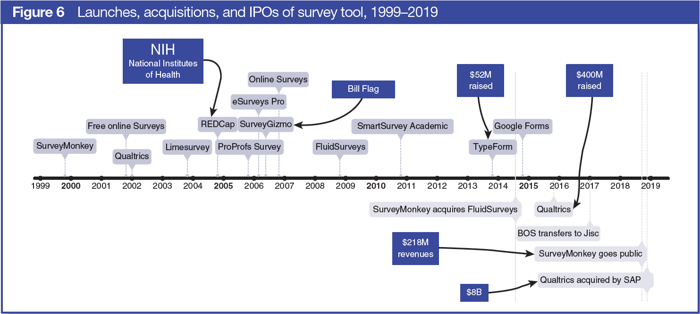
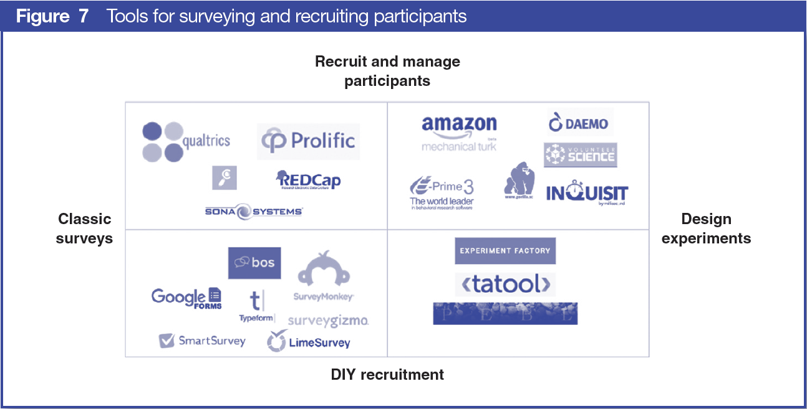

### Tools for Surveying and Sourcing Participants

**[Get full white paper as pdf](https://uk.sagepub.com/en-gb/eur/technologies-for-social-science-research).**

Surveys are probably the most common method for data collection in the
social sciences. Researchers used to carry clipboards, but now there are
more than 50 different software tools for surveying. The timeline in
Figure 6 shows a select number of survey tools and illustrates how
varied this space is: There are free and open source tools, tools
developed specifically for academics (REDCap, Bristol Online Surveys, SmartSurvey Academic), some
that developed quickly and raised a lot of money (TypeForm), and others
that have been less successful. Some acquired competitors and went
public (SurveyMonkey), and some had backing from angel investors
(SurveyGizmo). This part of the market is still shifting, with old and
new entrants, acquisitions, and fundraising, and yet more will come,
with machine learning having the potential to transform the way we
conduct surveys.

Of the surveying tools developed specifically for academics, the most
popular one is REDCap. REDCap is an open source survey and client
relationship management tool (CRM) developed initially for clinical
research and funded by the National Institutes of Health (NIH). The tool
grew a large supporting community and is now used across disciplines by
researchers who are comfortable with coding and concerned with privacy,
i.e., where person-identifiable data is stored.

Qualtrics may appear to be a recent entrant (their first press release
was in 2012), but they have been earning revenue since 2002, and by late
2016 they had raised almost \$400M to develop an advanced surveying
platform for research and business. Qualtrics is popular among social
science researchers and is considered an innovative company ([Qualtrics,
2019](https://www.qualtrics.com/news/qualtrics-ranked-top-10-most-innovative-company-in-2019-grit-report/)); it can source respondents and interface with almost anything,
including games and custom- built tools. At the end of 2018 it was
acquired by a business solutions company for \$8 billion ([SAP, 2019](https://news.sap.com/2018/11/sap-to-acquire-qualtrics-experience-management/)),
after having turned down another offer for \$500k a few years earlier,
according to a TechCrunch story ([Andersen, 2013](https://techcrunch.com/2013/03/02/the-story-behind-qualtrics-the-next-great-enterprise-company/)).

Whilst with most existing surveying tools researchers are responsible
for sourcing their own participants, there are now a number of tools
that can help with recruitment (Figure 7). The most commonly used is
Amazon's Mechanical Turk, though arguably the best one for academic
research is Prolific. Prolific (also known as Prolific Academic) was set
up in 2014 by then-PhD student Ekaterina Damer, who was herself
struggling with participant recruitment. Through the Oxford Innovation
Incubator, Damer and her team developed a minimum viable product in four
weeks, and in less than a year they grew both the participant pool and
the researcher (user) community rapidly. Prolific integrates with a
number of surveying and online experiment platforms ([Lumsden, 2019](https://ocean.sagepub.com/blog/how-to-run-an-online-experiment)) and,
at the time of writing, has 45,000 participants from across the
globe.

