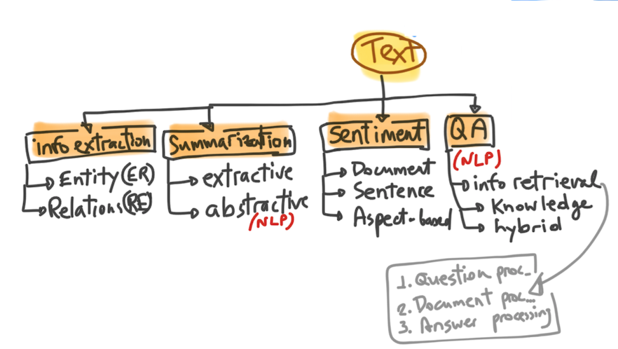
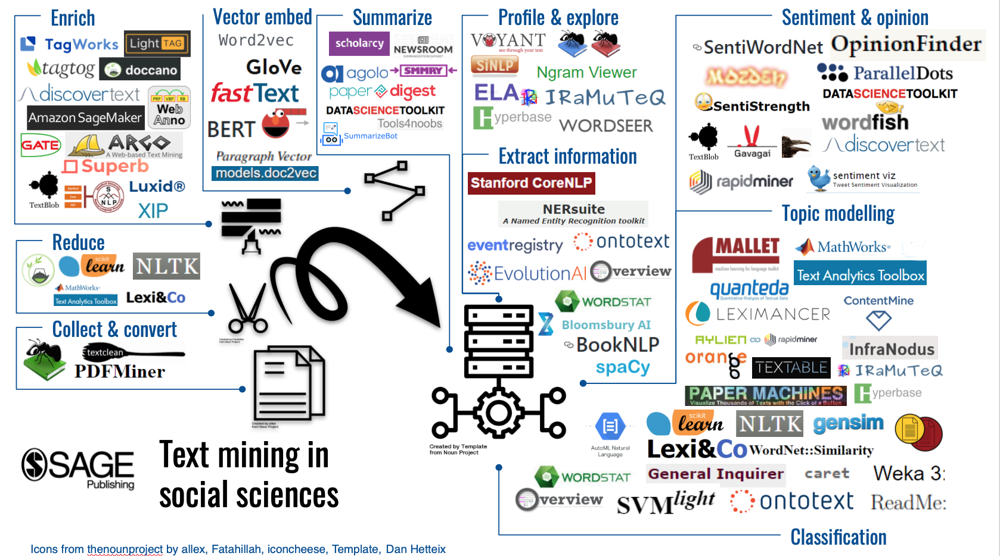
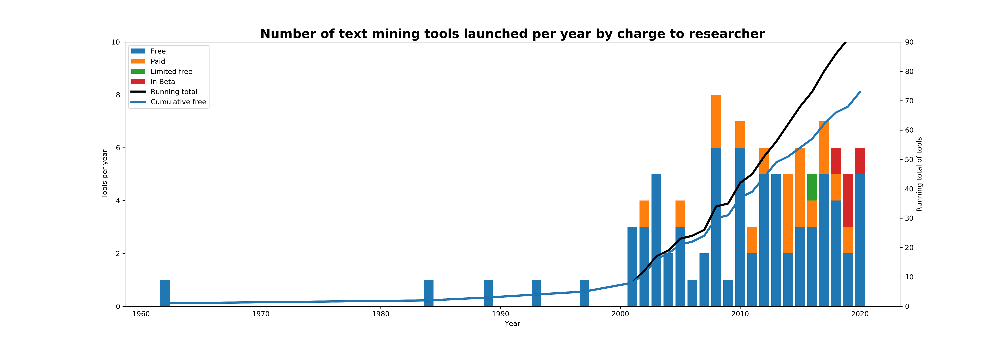
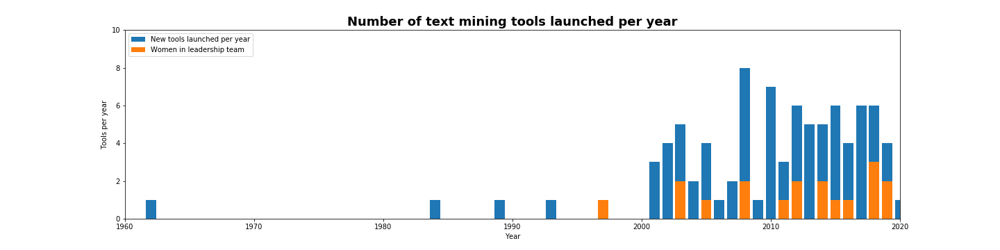
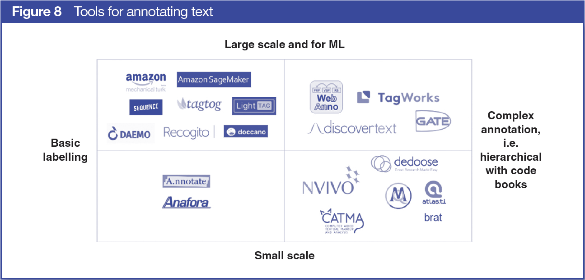

+ [Overview](#overview) of tools for mining text
+ [Key takeaways](#key-takeaways), reviewing 80+ tools
+ [Annotated text corpora](#annotated-text-corpora)
+ [Tools for annotating text](#tools-for-annotating-text)

## Overview
**From preprocessing to text analysis: 80 tools for mining unstructured data**

Text mining techniques have become critical for social scientists working with large scale social data, be it Twitter collections to track polarization, party documents to understand opinions and ideology, or news corpora to study the spread of misinformation.

Researchers and developers within the public and private sectors have been making strides in this space, and especially so in the past year. The improvements to the [representation of text with models like BERT from Google and the OpenAI’s GPT are the talk of the town](https://www.quantamagazine.org/machines-beat-humans-on-a-reading-test-but-do-they-understand-20191017) in computational linguistics since [they beat a benchmark for natural language understanding faster than predicted](https://openreview.net/pdf?id=rJ4km2R5t7). 

Meanwhile, political scientists like [Justin Grimmer and colleagues](https://www.semanticscholar.org/paper/Discovery-of-Treatments-from-Text-Corpora-Fong-Grimmer/3cbc814f6e42ac6c6cc2700f26ce3d7354a00150) are combining experimental methods, with computational text analysis to infer the features or pieces of text that are most likely to affect our voting behaviors. Others, are using platforms like IRaMuTeQ and Hyperbase that require no coding skills to run large scale text analysis projects.

In the infographic below, we identify more than 80 different apps, software packages, and libraries for R, Python and MATLAB that are used by social science researchers at different stages in their text analysis project. We focused almost entirely on statistical, quantitative and computational analysis of text, although some of these tools could be used to explore texts for qualitative purposes.

An infographic of text mining tools in the social sciences

## Key takeaways

#### Most tools are free, but high-performance tools require coding skills.

More than 70% (92 out of 130) of the tools we’ve identified for text cleaning, preprocessing, enriching, and all kinds of analysis are free to use, and a handful provide free trial periods. The free and/or open-source libraries and packages such as scikit-learn, spacy, gensim, quanteda, NLTK are high performance, i.e. the outputs are as good if not better than some of the paid-for options and the open-source no-code options. In other words, the more you want to get out of your corpus, the more comfortable you need to be with R or Python in order to find and use these packages and especially if you want to apply transformers and language representation models to your dataset. 

Graph showing tools and packages for text mining by charge 1962-2019

Graph showing text mining tools and packages launched per year, including those with women in leadership teams, where data is available.

#### Most tools that do not require coding skills are relatively old.

A suite of free and some paid applications are available for researchers that don’t code, such as Voyant, Lexi&co, IRaMuTeQ, Hyperbase, Mallet, Orange Text and Data Mining. Beside Voyant, which was launched seven years ago, the other software was developed in the 1990s to early 2000s, when coding was not as widespread a skill as it is today. However, some of the statistical analysis these tools offer is remarkable. 

#### There is an increasing number of apps with great user interfaces, and some of them free, which enable you to enrich your corpus.

An important step, primarily for those that build their own packages and analysis tools, is to enrich the corpus. The most common tasks are part-of-speech tagging. We noted that researchers increasingly require to annotate samples of their corpus in order to train a topic modeling or classification algorithm. This, combined with the booming chatbot market and the needs of large businesses to sort through their documents, are driving the development of paid web apps and open-source packages for text labeling. More than 10 tools were launched just in the past three years: Explosion AI, the developer behind spaCy, launched prodi.gy; Amazon released its GroundTruth SageMaker to integrate with Mechanical Turk and other human-in-the-loop services like iMerit. The most active one is probably doccano, it’s free to use and in just one year it grew to 24 contributors. We’ve invested in TagWorks, which integrates with Mechanical Turk and offers a more hierarchical annotation schema.

#### The most time-consuming bit is cleaning and preprocessing.

Whilst you can preprocess and reduce your text with a few of these tools (for example Orange, IRaMuTeQ, Hyperbase, scikit-learn, MathWorks Text Analytics Toolbox, NLTK, quanteda), you still need to format and clean your corpus before you load it in. We’ve heard from many researchers that their biggest pain point and frustration is cleaning and doing some of the pre-processing. Main reasons being: 

- it takes much longer than expected and at least three times the amount they spent on the fun part (analysis!);

- they prefer not to teach cleaning and preprocessing and leave that for workshops and working groups; and 

- they almost never go back to this part of the process after they ran their analysis, although they acknowledge that testing their analysis on whatever decisions they’ve taken for preprocessing may add an extra layer of confidence in their outputs.

There are just about a handful of tools to help with converting file formats: PDFminer is a Python parser and analyzer for PDF documents and can convert them into HTML, but the most common is AntFileConverter from Laurence Anthony, which converts PDFs and DOCs into plain text. TextClean is a neat collection of tools for cleaning and normalizing text documents in R, and it’s open-source. If you are working with existing text datasets from the web, like the 20 Newsgroup or the Pen Tree Bank, you still need to do some work before you fit them to your analysis algorithms, and there is a package in Python that can simplify this step.

#### Once you master some of these tools, they will save you time.

One thing is certain, there are plenty of software applications, libraries and packages that can help support your large scale text analysis project. You can try the easier-to-use ones like Orange and move to applying argument analysis algorithms and language models to your growing corpus. We’ve got [a course to get your started](https://campus.sagepub.com/introduction-to-text-mining-for-social-scientists). 

# Annotated text corpora

When working with text mining tools or learning how to use them, the biggest problem is finding a ready-to-use corpus. In many instances, you’d need a readily labeled one to test, especially if you don’t have the time to do the annotations yourself or the money to crowdsource the task before you work on your actual corpus. Here are 10 sources of (publicly available and free) labeled text corpora to get you started:
 
+ [Reuters newswire in 1987](http://kdd.ics.uci.edu/databases/reuters21578/reuters21578.html) indexed by category, aka Reuters-21578, contains 21,578 news articles, though only about 12 thousand are manually indexed across 135 categories; best for training classification algorithms.
+ [The 20 Newsgroups dataset](http://qwone.com/~jason/20Newsgroups/) contains close to 20 thousand documents categorized across 20 groups; best for training on classification and clustering.
+ [MPQA Opinion Corpus](http://mpqa.cs.pitt.edu/corpora/mpqa_corpus) contains under one thousand news articles and other documents that are annotated manually for opinions, beliefs, emotions, speculations
+ [This](https://tabfact.github.io/) corpus contains about 16 thousand annotated wikipedia tables to study fact verification. 
+ [Stanford labeled Rotten Tomatoes dataset](https://nlp.stanford.edu/sentiment/code.html) for sentiment analysis, includes paper and code.
+ [Stanford 25 thousand labeled and 25 thousand test datasets with IMDB movie reviews](http://ai.stanford.edu/~amaas/data/sentiment/) for sentiment analysis.
+ The [training data for Sentiment140](http://help.sentiment140.com/for-students) is a collection of just under 200 thousand labeled tweets for sentiment analysis.
+ An [aggregated corpus of more than 10 different sources](https://github.com/sarnthil/unify-emotion-datasets), including tweets, news articles. Blogs, dialogues,, mapped to a unified tagging schema for emotion classification resulting in more than 20 thousand statements for 6 different emotions.
+ [SMS Spam Collection](http://www.dt.fee.unicamp.br/~tiago/smsspamcollection/) contains just over 5 thousand English mobile text messages labelled according to whether they are spam or not.
+ [Dataturks A set of 405 mostly Spanish reviews for academic papers](https://archive.ics.uci.edu/ml/datasets/Paper+Reviews) submitted to an international computing conference, with the reviewers’ scores, and another set of scores labeled by readers of the reviews.

You can also check the [trending projects on Dataturks](https://dataturks.com/projects/trending) which lists classified and labeled text datasets in multiple languages. Similarly, [tagtog have a running list](https://www.tagtog.net/-datasets) of public projects across domains. The [National Centre for Text Mining in the UK releases corpora for text mining](http://www.nactem.ac.uk/resources.php) for social sciences but also STEM research, some of which are annotated for sentiment and entities. Many NLP developers also keep track of useful datasets for machine learning, many on GitHub and loads on Kaggle. I recently came across this [very neat list](https://www.datasetlist.com/) that includes multiple formats for multiple tasks and information about the license. However, if you are looking for a real challenge, then explore [TREC datasets](https://trec.nist.gov/data.html) from the National Institutes of Standard and Technology in the US. 

# Tools for annotating text
### 2. Annotation, Labelling, and Coding Text

We found 48 tools (60 if including CAQDAS, *Computer Assisted Qualitative Data Analysis Software generally refers to packages like NVIVO, MaxQDA, Atlas.ti, etc.*) that offer labelling or
annotation services for text. Ten (20%) of these have not been updated
for at least a year. Thirty-three (69%) are free to use, and pricing for
the remaining 15 (31%) ranges from approximately \$60 to \$10,000 for a
1-year project or to tag 2,500 documents with three
annotators (*These criteria were adjusted according to the features of each pricing model.*). 

The oldest annotation tools (besides the CAQDAS) are GATE and Open
Calais. GATE is open source and very popular with researchers using
complex coding schemas and larger text corpora, while Open Calais is for
active work---labelling as you write. Given the proliferation of machine
learning, especially around text mining, the need to annotate larger
corpora to serve as training datasets has grown. This has driven a boom
in new text annotation tools, each with unique selling points and
improved user experience.

Broadly speaking, there are two types of tools in this space: the
recent tools that support semiautomated tagging (i.e., if you label a
word or a phrase, it will label it in the remainder of your documents,
automating a part of the task) and the classic annotation tools that
support custom coding schemas. Tagtog, LighTag, Doccano, and Dataturks
are relatively new semiautomated tagging tools. Integrated with
Mechanical Turk, the most recent entrant to this space is Amazon's
SageMaker, which promises to beat most other tools in rapidly
crowdsourcing labels to train your algorithm. For researchers looking
for a more complex set of labels and who are building a hierarchical
coding schema, TagWorks (beta; *SAGE Publications invested in Thusly, the company that offers TagWorks, in 2018.*) was developed to support these
functions. Figure 8 maps a select number of the tools for annotating
text based on complexity of labelling and how well they
scale.

A range of open source, free to use, publicly funded tools provide
similar manual annotation services, with a greater focus on
inter-annotator agreements and developing robust code books. They rely
on community input, and although they have been developed within old
infrastructure, they are actively used. The oldest, GATE, can score up
to thirty thousand downloads a year. Brat has 218 forks on GitHub and
more than 200 members within their contributing community, and along
with TAMS Analyzer, we estimate they are cited more often than the other
annotation tools (between 130 and 630, vs. less than 100 for the
rest. *The inferences are based on most popular papers.*) GATE, Brat, and TAMS Analyzer appear in the first two pages
in a Google search for "text annotation," and they are often recommended
on Quora and ResearchGate as the best options for a social science
labelling task.

