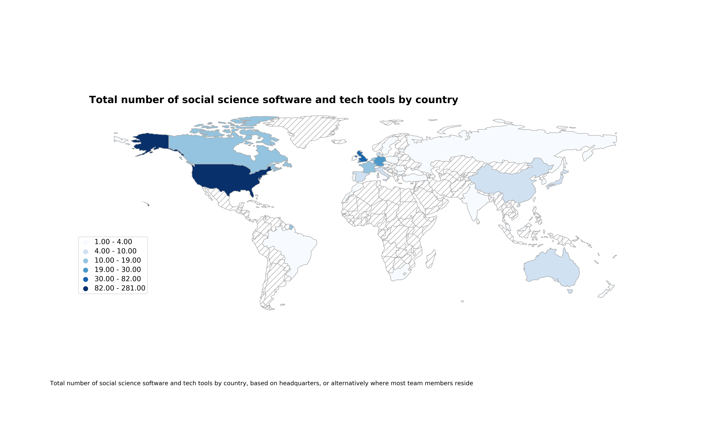
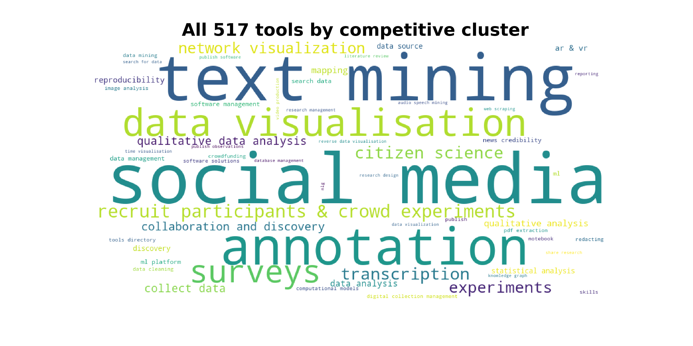
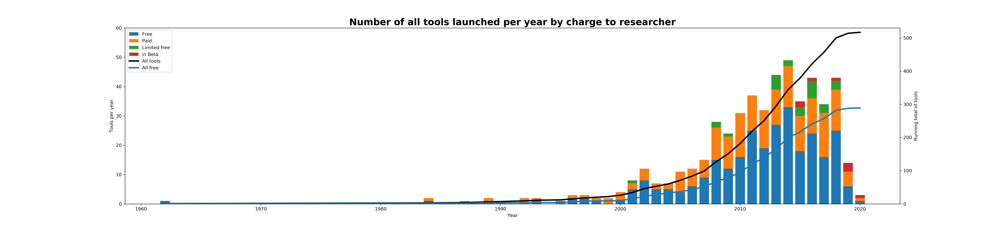
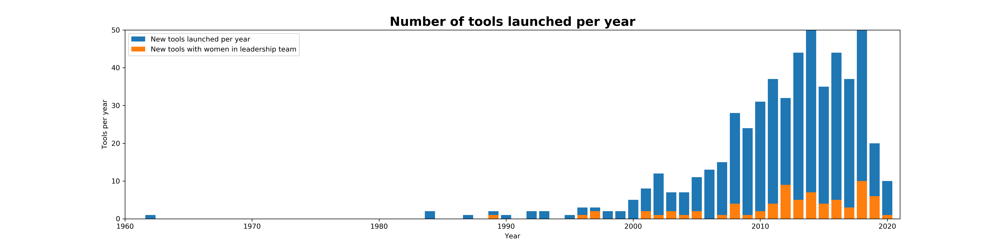
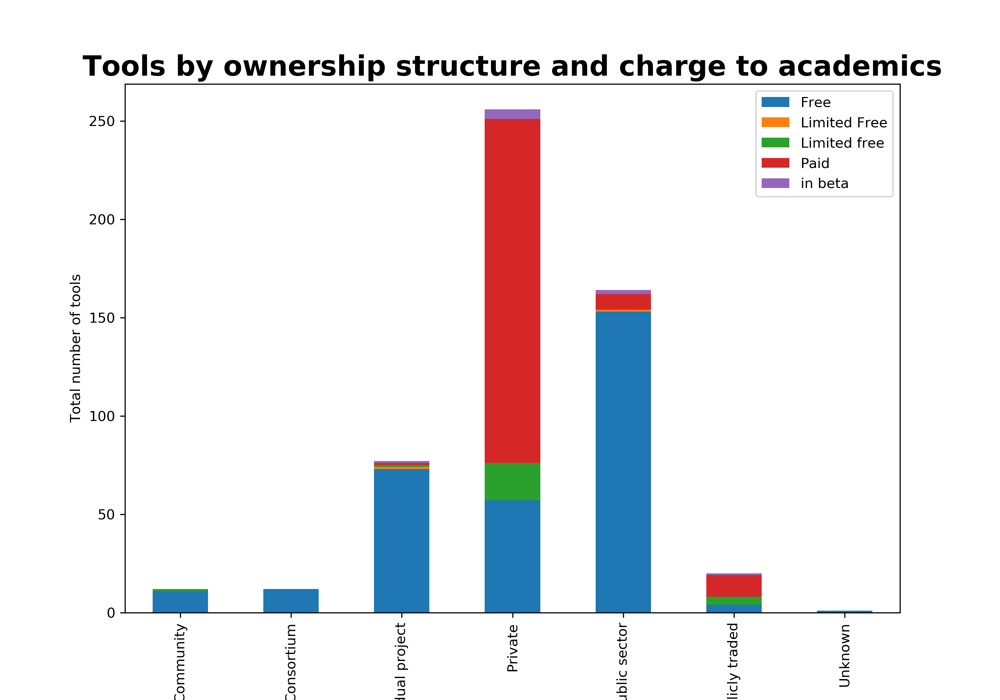

+ [Overview](#overview) of tools for social science research
+ [Key takeaways](#key-takeaways), reviewing 500+ tools

## Overview

Since the publication of our [whitepaper](https://uk.sagepub.com/en-gb/eur/technologies-for-social-science-research) in the fall of 2019, we've added more than 100 tools to our list. We are continuously updating the key figures from the paper, and this post will contain the most up-to-date numbers and visuals. 

## Key takeaways

There is a growing number of tools and technologies for social science research, both developed by academics, as well as from the private sector. The large majority are still coming out of the US and UK.

Our sample of tools covers mostly those focused on text mining, social media, qualitative data analysis and annotation of text and images, data visualization and surveying.

There are about as many free as there are paid-for, or limited free tools available.

The number of tools that are developed by diverse teams (in this case teams that include at least one woman), is still small, and not necessarily growing. The data is based on 435 tools for which we could find leadership information.

In terms of the organizational structure behind the tools, the breakdown is similar to what we noted in the whitepaper.

